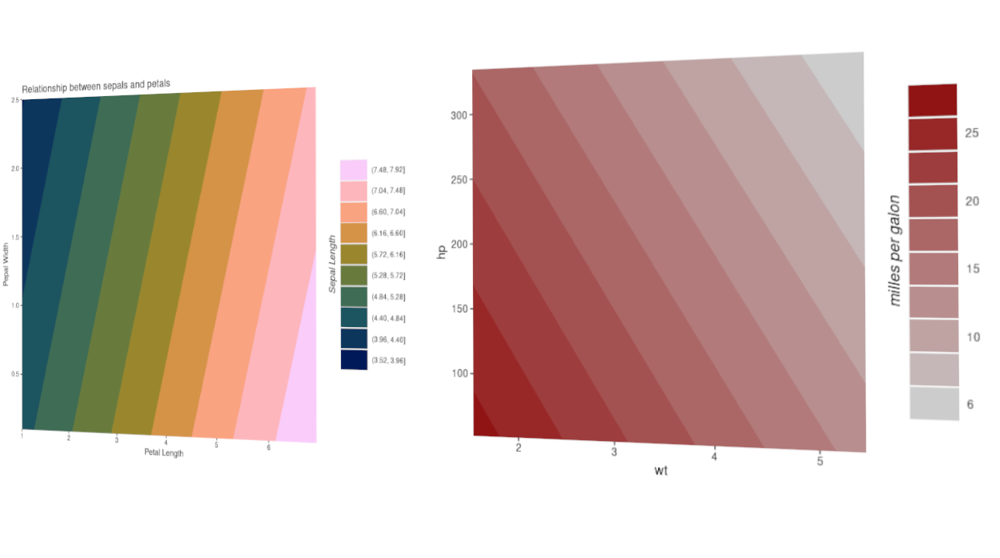

# ggmodel
A function collection to plot R base model objects with ggplot2

</img>

## How to install

To install the `ggmodel` run the following line:

```{r}
remotes::install_github("wilsonfrantine/ggmodel")
```

## A simple example

```{r}
library(ggmodel)
data(mtcars)

m <- glm(mpg ~ wt + hp, data=mtcars, family = "gaussian")

ggsurface(m, x.var = "wt", y.var = "hp",
          legend.title = "milles per galon", high.col = "darkred", 
          round.legend = 0)
```


At the moment, the package is very prototype. 
It just have one function for plotting multiple lm or glm surfaces
`ggsurface()`

To get help try

```{r}
?ggsurface
```

