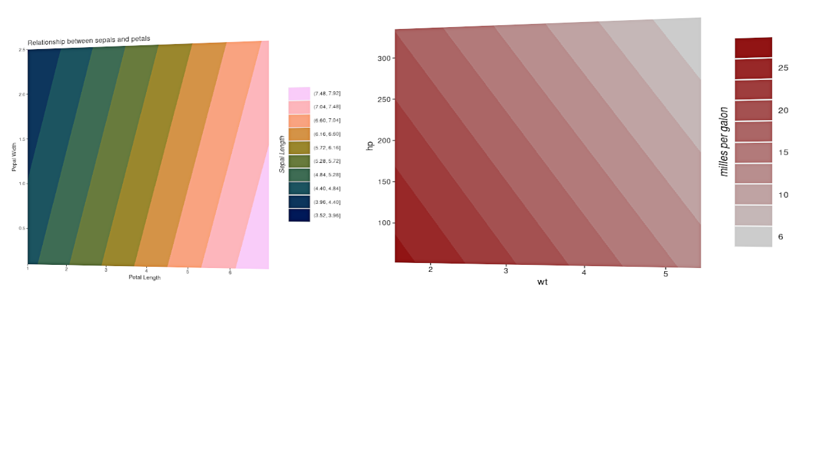
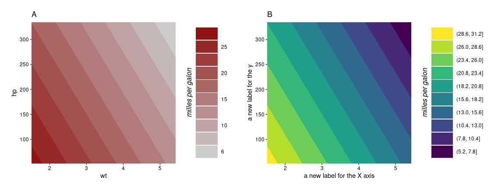

# ggmodel
A collection o functions to plot R base model objects with ggplot2



## How to install

To install the `ggmodel` run the following line:

```{r}
remotes::install_github("wilsonfrantine/ggmodel")
```

## A simple example

```{r}
library(ggmodel)
data(mtcars)

m <- glm(mpg ~ wt + hp, data=mtcars, family = "gaussian")

mPlot <- ggsurface(m, x.var = "wt", y.var = "hp",
           legend.title = "milles per galon", high.col = "darkred", 
           round.legend = 0)
           
mPlot
```


## Adjusting aesthetics

As a ggplot2 object, you can change wherever you want in the graph with ggplot2 sintaxe.

```{r}
mPlot2 <- mPlot + 
           ggtitle(label= "The title of my plot is...") + 
           labs( 
                x = "a new label for the X axis",
                y = "a new label for the y", 
                fill = "a new label for the legend"
                ) +
           scale_fill_viridis_d() # a new color scale.

mPlot2
```


## Creating a composition

One of the greatest things in ggplot2 is the variaty of possibilities.
There are several packages to do almost anything with these plots.

One of my favorits is the `patchwork` package ( `install.packages("pacthwork")` ).
This package can create composition of different plots, so...

```{r}
library("patchwork")

mPlot+ggtitle("A") + mPlot2+ggtitle("B")

```


## Disclaimer

At the moment, the package is very prototype.
It just have one function for plotting multiple lm or glm surfaces
`ggsurface()`

To get help try

```{r}
?ggsurface
```
Any crash, mail-me: wilsonfrantine@gmail.com

Have fun!
